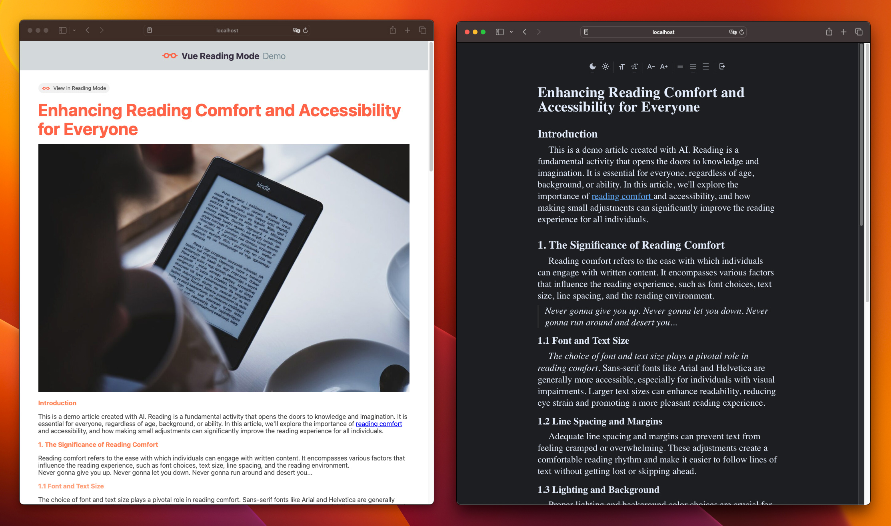

[](https://madewithvuejs.com/p/vue-reading-mode/shield-link)

# Vue Reading Mode
Vue Reading Mode provides an alternative reading experience for articles and blogs.

DEMO https://vue-reading-mode.netlify.app



### Main features
Removes all interface elements that will distract while reading and focuses only on the text.
### vue-reading-mode settings;
- Dark and Light mode options,
- Sans serif and Serif font options,
- Font size settings,
- Line height settings

### Usage
```html
<vue-reading-mode>
    ...your article in html 
</vue-reading-mode>
```